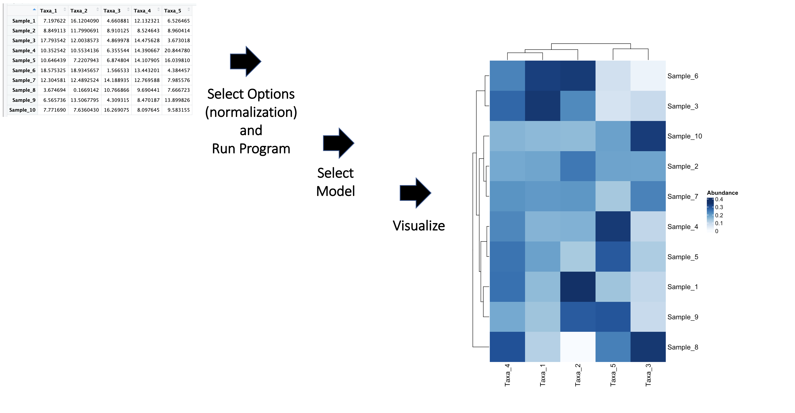

<!-- README.md is generated from README.Rmd. Please edit that file -->

# MicrobiomeExplorer

## Description

`MicrobiomeExplorer` is designed to facilitate the analysis of
microbiome data, helping scientists and researchers to gain insights
into microbial communities. Through this package, users can process,
analyze, and visualize data from 16S rRNA gene sequencing, metagenomic,
and metatranscriptomic studies. The goal is to provide a comprehensive
toolset that improves upon existing workflows by integrating multiple
data types and offering advanced graphical outputs. The
`MicrobiomeExplorer` package was developed using
`R version 4.3.1 (2023-06-16)`, `Platform: aarch64, darwin20` and
`Running under: macOS Sonoma 14.0`. and is intended to be
platform-independent, supporting macOS, Windows, and Linux
distributions.

## Installation

Before installing MicrobiomeExplorer, you must first install its
dependencies. Notably, phyloseq and ComplexHeatmap are available through
Bioconductor, not CRAN, and require Bioconductor’s installation methods.

Please run the following commands to install the current version of the
dependency packages:

To install the current version of `MicrobiomeExplorer` from GitHub, use:

``` r
# Install devtools if not already installed
if (!requireNamespace("devtools", quietly = TRUE))
    install.packages("devtools")
    
# Install MicrobiomeExplorer from GitHub
devtools::install_github("itsSabbir/MicrobiomeExplorer", build_vignettes = TRUE)
#> Skipping install of 'MicrobiomeExplorer' from a github remote, the SHA1 (b1591b99) has not changed since last install.
#>   Use `force = TRUE` to force installation

# Load MicrobiomeExplorer
library(MicrobiomeExplorer)
```

To run the shinyApp:

``` r
runMicrobiomeExplorerApp()
```

## Overview

`MicrobiomeExplorer` offers a suite of functions that facilitate the
exploration and analysis of microbiome data. Here is a list of the main
functions along with a brief description:

- `calculateStats`: Calculates extended statistics (mean, median,
  standard deviation, variance, range, and interquartile range) for each
  feature in a microbiome dataset, providing a comprehensive statistical
  overview essential for preliminary data analysis.

- `plotMicrobiomeHeatmap`: Creates a comprehensive heatmap for
  microbiome data analysis, with support for normalization, various
  clustering methods, and enhanced visualization options using the
  `ComplexHeatmap` package.

- `advancedRarefactionPlot`: Generates rarefaction curves for microbiome
  count data, useful for comparing species richness among samples with
  customizable sampling and plot aesthetics.

- `calculateAlphaDiversity`: Computes various alpha diversity indices
  (like Shannon, Simpson, Chao1, and ACE) for each sample in a
  microbiome dataset, facilitating in-depth ecological and diversity
  studies.

- `addData`: Adds new data to a MicrobiomeData object, ensuring class
  compatibility and handling overlapping samples with advanced merging
  strategies. Supports rRNA16S, Metagenomic, or Metatranscriptomic data
  types, with specific validation for each..

- `mergeData`: Helper function to merge data matrices within
  MicrobiomeData objects, offering advanced merging options for
  overlapping data (like averaging or prioritizing new/existing data).

- `removeData`: Removes specified data (rRNA16S, Metagenomic, or
  Metatranscriptomic) from a MicrobiomeData object, simplifying data
  management and manipulation.

- `updateSampleInfo`: Updates the sample information in a MicrobiomeData
  object, ensuring consistency and integrity of new sample data with
  existing datasets.

- `validateSampleInfo`: Validates new sample information against
  existing data in MicrobiomeData objects, checking for consistency in
  sample counts, uniqueness, and matching identifiers.

- `validate16SRNAData`: Checks 16S rRNA gene sequencing data for
  structure, quality, and content, including numeric values, absence of
  negative values, minimum column and non-zero entry requirements, and
  no missing values.

- `validateMetagenomicData`: Validates metagenomic data for structure
  and quality, ensuring numeric values, no negative or extremely high
  values, and adequate dimensions.

- `validateMetatranscriptomicData`: Ensures metatranscriptomic data
  integrity by checking format, numeric values, non-negativity,
  potential outliers, and sequencing depth consistency.

- `MicrobiomeData S4 Class`: Defines an S4 class for managing microbiome
  data, including types such as 16S rRNA gene sequencing, metagenomic,
  and metatranscriptomic data, along with sample information.

- `createMicrobiomeDataObject`: Initializes a MicrobiomeData object with
  provided data, performing validation checks on the input data.

- `getData`: Extracts specified data type (‘rRNA16S’, ‘Metagenomic’,
  ‘Metatranscriptomic’, ‘SampleInfo’) from a MicrobiomeData object.

- `updateData`: Updates specific data within a MicrobiomeData object,
  allowing modification of existing data slots.

- `performDifferentialExpression`: Conducts differential expression
  analysis on microbiome data using either DESeq2 or EdgeR methods. It
  filters data based on count thresholds, normalizes counts, and returns
  results of the statistical analysis.

- `runMicrobiomeExplorerApp`: Initiates a Shiny application for the
  MicrobiomeExplorer package. This app provides an interactive interface
  for visualizing, analyzing, and exploring microbiome data. It supports
  various functionalities like plot generation and statistical analysis.
  The function launches the app in the user’s default web browser and is
  located in the `./inst/shiny-scripts` directory of the
  MicrobiomeExplorer package.

To list the functions and datasets provided by `MicrobiomeExplorer`,
use:

``` r
ls("package:MicrobiomeExplorer")

data(package = "MicrobiomeExplorer") # if applicable
```

For a comprehensive tutorial on how to use MicrobiomeExplorer, check out
the vignettes:

``` r
browseVignettes("MicrobiomeExplorer")
```

The package also contains one sample micriobiome dataset presented as a
dataframe called microbiome_data.csv. Refer to package vignettes for
more details. An overview of the package is illustrated below.

A more standard barebones look: 

## Contributions

The MicrobiomeExplorer package was developed by Sabbir Hossain. The
development of this package was inspired and informed by various
established tools and methods within the bioinformatics community.
Contributions from existing R packages and other sources are duly noted
for each function within the package.

- **phyloseq**: Enhances data management, particularly in functions like
  `calculate_stats` and `calculate_alpha_diversity`, offering robust
  handling of complex microbiome datasets.

- **ggplot2**: Underpins the visualization aspects in
  `plot_microbiome_heatmap` and `plot_rarefaction`, providing elegant
  and informative data representation.

- **vegan**: Contributes to diversity analysis, especially in
  `calculate_alpha_diversity` and `plot_rarefaction`, delivering
  extensive ecological insights.

- **dplyr** and **tidyr**: Facilitate efficient data manipulation across
  the package, crucial for preprocessing and organizing data for
  analysis.

## References

MicrobiomeExplorer integrates methods and insights from various sources,
ensuring a robust and versatile tool for the scientific community. Key
references include:

- McMurdie, P.J., and Holmes, S. (2013). [phyloseq: An R Package for
  Reproducible Interactive Analysis and Graphics of Microbiome Census
  Data](https://journals.plos.org/plosone/article?id=10.1371/journal.pone.0061217).
  PLoS ONE 8(4): e61217.
- Wickham, H. (2016). [ggplot2: Elegant Graphics for Data
  Analysis](https://ggplot2.tidyverse.org/reference/ggplot2-package.html).
  Springer-Verlag New York.
- Oksanen, J., et al. (2019). [vegan: Community Ecology
  Package](https://cran.r-project.org/web/packages/vegan/index.html). R
  package version 2.5-6.

Additional literature and resources that have contributed to the
development of MicrobiomeExplorer:

- Callahan, B.J., et al. (2016). [DADA2: High-resolution sample
  inference from Illumina amplicon
  data](https://www.nature.com/articles/nmeth.3869). Nature Methods,
  13(7), 581-583.
- Paulson, J.N., et al. (2013). [Differential abundance analysis for
  microbial marker-gene
  surveys](https://www.nature.com/articles/nmeth.2658). Nature Methods,
  10(12), 1200-1202.
- Love, M.I., Huber, W., & Anders, S. (2014). [Moderated estimation of
  fold change and dispersion for RNA-seq data with
  DESeq2](https://genomebiology.biomedcentral.com/articles/10.1186/s13059-014-0550-8).
  Genome Biology, 15(12), 550.

## Acknowledgements

This package was developed as part of an assessment for 2023 BCB410H:
Applied Bioinformatics course at the University of Toronto, Toronto,
CANADA. MicrobiomeExplorer welcomes issues, enhancement requests, and
other contributions. To submit an issue, use the GitHub issues.

## Equity, Diversity, and Inclusion (EDI)

MicrobiomeExplorer is committed to EDI principles, providing accessible
documentation and actively seeking community feedback to cater to a
broad audience. Challenges such as data bias, accessibility, and global
representation are acknowledged and addressed to the best of the
developers’ abilities.

## Reproducibility

Reproducibility is ensured through rigorous version control,
comprehensive documentation, clear specification of dependencies,
automated testing, and continuous integration. A Docker container is
also provided to facilitate a consistent and controlled environment for
all users.

## Package Structure

The MicrobiomeExplorer package is organized as follows:

``` r
- MicrobiomeExplorer
  |- .DS_Store
  |- .Rbuildignore
  |- .gitignore
  |- DESCRIPTION
  |- LICENSE
  |- LICENSE.md
  |- MicrobiomeExplorer.Rproj
  |- NAMESPACE
  |- README.Rmd
  |- README.md
  |- mbeUtils.Rmd
  |- data/
     |- microbiomeExample.rda
     |- microbiome_example.rda
  |- inst/
     |- extdata/
        |- microbiomeExampleObjectShin...
        |- microbiome_exampleShiny.csv
  |- man/
     |- AdvancedRarefactionPlot.Rd
     |- MicrobiomeData-class.Rd
     |- addData.Rd
     |- calculate_alpha_diversity.Rd
     |- calculate_stats.Rd
     |- createMicrobiomeDataObject.Rd
     |- getData.Rd
     |- microbiomeExample.Rd
     |- microbiome_example.Rd
     |- performDifferentialExpression.Rd
     |- plot_microbiome_heatmap.Rd
     |- removeData.Rd
     |- runMicrobiomeExplorerApp.Rd
     |- updateData.Rd
     |- updateSampleInfo.Rd
     |- validate16SRNAData.Rd
     |- validateMetagenomicData.Rd
     |- validateMetatranscriptomicData...
     |- validateSampleInfo.Rd
  |- R/
     |- advancedRarefactionPlot.R
     |- calculateAlphaDiversity.R
     |- calculateStats.R
     |- data.R
     |- dataManipulationFunctions.R
     |- dataValidationFunctions.R
     |- microbiomeDataClass.R
     |- performDEAnalysis.R
     |- plotMicrobiomeHeatmap.R
     |- runMicrobiomeExplorer.R
  |- tests/
     |- testthat/
        |- test-AdvancedRarefactionPlot.R
        |- test-DataManipulationFunction...
        |- test-MBDataClass.R
        |- test-calculateStats.R
        |- test-plotMicrobiomeHeatmap.R
        |- testthat.R
  |- vignettes/
     |- .DS_Store
     |- introduction_MicrobiomeExplore...
     |- sabbir.png
  |- shiny-scripts/
     |- app.R
```
